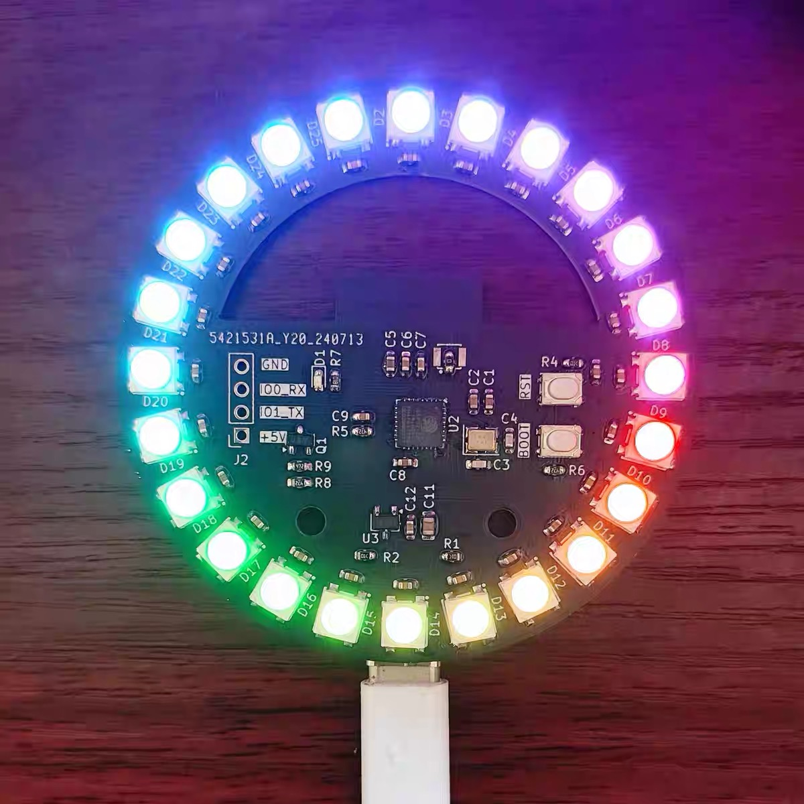
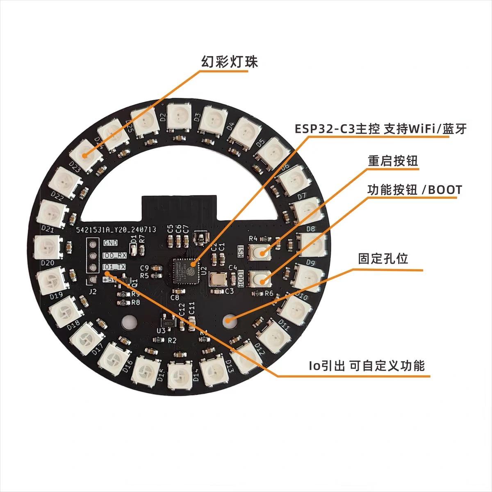
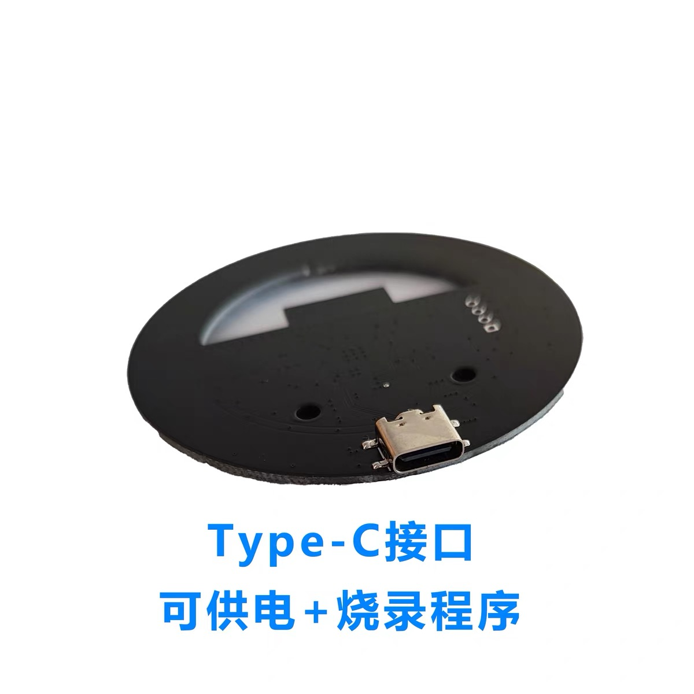
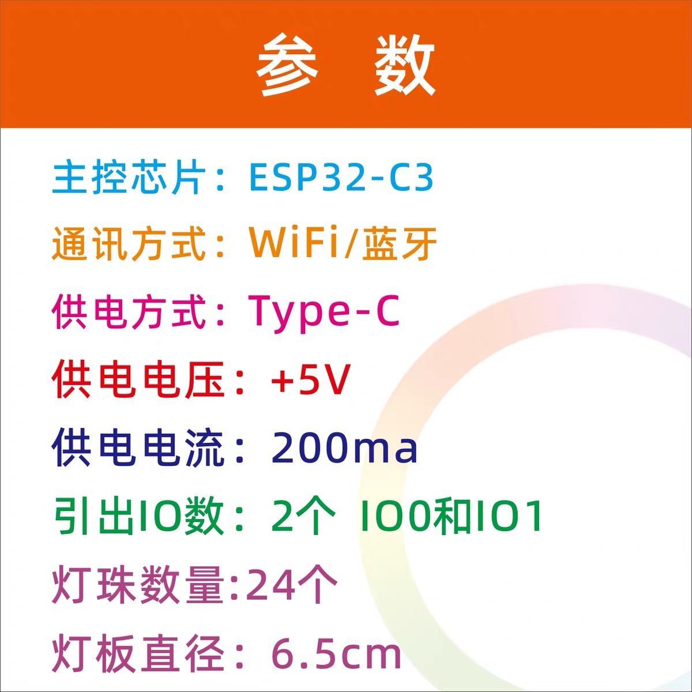

# Claude Aura

用 ESP32-C3 + 24 颗 WS2812 灯环打造 Claude Code 状态指示灯，通过蓝牙实时联动：Claude 工作时变紫色，空闲时变橙黄色，等待输入时变红色，会话结束自动关灯。

  



---

## 状态对照

| 状态 | 灯光颜色 | 触发时机 |
|---|---|---|
| **working** | 紫色 `(200, 0, 255)` | 发送 prompt、Claude 使用工具 |
| **idle** | 橙黄色 `(255, 180, 50)` | Claude 回复完毕、会话开始 |
| **input** | 红色 `(255, 0, 0)` | 等待用户输入、权限确认弹窗 |
| **off** | 关灯 | 会话结束 |

---

## 硬件

- ESP32-C3 开发板（任意品牌）
- WS2812 灯环，24 颗灯珠
- WS2812 数据线接 **GPIO 3**
- USB 供电（充电头或充电宝，可脱离电脑独立供电）

| 正面（组件标注） | 背面（Type-C 接口） |
|---|---|
|  |  |



---

## 软件依赖

- macOS（BLE 通过 CoreBluetooth）
- Python 3.10+
- [bleak](https://github.com/hbldh/bleak) 3.x
- [Claude Code](https://docs.anthropic.com/en/docs/claude-code) CLI

---

## 安装

### 1. 烧录 ESP32 固件

用 Arduino IDE 打开 `claude_lamp_esp32c3/claude_lamp_esp32c3.ino`，安装以下依赖库后烧录：

- **NimBLE-Arduino** — BLE 协议栈
- **Adafruit NeoPixel** — WS2812 驱动

固件烧录后，ESP32 会以设备名 `MOONSIDE-LAMP` 广播 BLE（模拟 Nordic UART Service 协议），串口监视器（115200）可看到启动日志。

### 2. 创建 Python 虚拟环境

```bash
python3 -m venv ~/.claude-lamp-env
~/.claude-lamp-env/bin/pip install bleak
```

### 3. 部署 Hook 脚本

```bash
mkdir -p ~/.claude/moonside_hooks
cp claude_hooks/moonside_hook.sh claude_hooks/moonside_daemon.py ~/.claude/moonside_hooks/
chmod +x ~/.claude/moonside_hooks/moonside_hook.sh
```

### 4. 配置 Claude Code Hooks

将 `.claude/settings.json` 的内容合并到 `~/.claude/settings.json`，或直接复制：

```bash
cp .claude/settings.json ~/.claude/settings.json
```

Hooks 覆盖以下事件：

| 事件 | 状态 |
|---|---|
| `SessionStart` / `Stop` | idle |
| `UserPromptSubmit` / 工具调用 | working |
| `AskUserQuestion` / `PermissionRequest` | input |
| `SessionEnd` | off |

### 5. 验证

启动 Claude Code，查看 daemon 日志：

```bash
tail -f /tmp/moonside_daemon.log
```

首次连接需要 5–15 秒扫描设备，连接成功后日志显示 `Connected to MOONSIDE-LAMP`。

---

## 颜色与亮度配置

编辑 `claude_hooks/moonside_daemon.py` 顶部的配置项：

```python
WORKING_CMD    = build_color_cmd(200, 0, 255)   # 工作中：紫色
COLOR_IDLE     = build_color_cmd(255, 180, 50)  # 空闲：橙黄色
COLOR_INPUT    = build_color_cmd(255, 0, 0)     # 等待输入：红色
BRIGHTNESS_CMD = "BRIGH048"                     # 亮度 40%（范围 0-120）
```

亮度换算：`目标% × 1.2` 取整 → 如 60% = `BRIGH072`，80% = `BRIGH096`。

修改后重新部署：

```bash
cp claude_hooks/moonside_daemon.py ~/.claude/moonside_hooks/
```

---

## 项目结构

```
claude-aura/
├── claude_lamp_esp32c3/
│   └── claude_lamp_esp32c3.ino   # ESP32-C3 固件
├── claude_hooks/
│   ├── moonside_daemon.py        # BLE 后台 daemon
│   ├── moonside_hook.sh          # Claude Code hook 入口脚本
│   └── settings.json             # Claude Code hooks 配置
└── .claude/
    └── settings.json             # 已部署的全局 hooks 配置
```

---

## 工作原理

```
Claude Code 事件（SessionStart / UserPromptSubmit / Stop 等）
  └→ moonside_hook.sh
       ├─ 写入状态到 /tmp/moonside_state
       └─ 检查 daemon 是否存活，否则自动启动
            └→ moonside_daemon.py（后台常驻）
                 ├─ 每 200ms 读取 /tmp/moonside_state
                 ├─ 状态变化时通过 BLE 发送颜色命令
                 └─ 空闲 30 分钟后自动关灯退出
```

Daemon 保持持久 BLE 连接，避免每次事件重连的 5–15 秒延迟。

### 运行时文件

| 文件 | 用途 |
|---|---|
| `/tmp/moonside_state` | 当前状态（working / idle / input / off） |
| `/tmp/moonside_daemon.pid` | Daemon 进程 PID |
| `/tmp/moonside_daemon.log` | 运行日志 |
| `/tmp/moonside_daemon.lock` | 防止多实例锁 |

---

## BLE 协议

ESP32 固件模拟 Nordic UART Service（NUS），命令为 ASCII 文本，发送到 RX 特征（`6e400002-...`）：

| 命令 | 格式 | 示例 |
|---|---|---|
| 开灯 | `LEDON` | `LEDON` |
| 关灯 | `LEDOFF` | `LEDOFF` |
| 设置颜色 | `COLORrrrgggbbb`（各3位） | `COLOR255180050` |
| 设置亮度 | `BRIGHbbb`（0-120） | `BRIGH048` |
| 主题 | `THEME.NAME.R,G,B,...` | `THEME.BEAT2.255,255,255` |

---

## 排障

### 灯不亮 / daemon 找不到设备

macOS 会自动重连已配对的 BLE 设备，设备连接后停止广播，导致 bleak 扫描失败。本项目的 daemon 已内置回退逻辑，通过 CoreBluetooth 的 `retrieveConnectedPeripheralsWithServices_` 直接获取已连接设备，无需手动处理。

若仍无法连接，检查：

```bash
# 查看日志
tail -20 /tmp/moonside_daemon.log

# 确认 macOS 能看到设备
system_profiler SPBluetoothDataType | grep -A3 MOONSIDE
```

### 手动重启 daemon

```bash
kill $(cat /tmp/moonside_daemon.pid) 2>/dev/null
rm -f /tmp/moonside_daemon.pid /tmp/moonside_state /tmp/moonside_daemon.lock
~/.claude-lamp-env/bin/python3 ~/.claude/moonside_hooks/moonside_daemon.py &
```

### 手动测试颜色

```bash
echo "working" > /tmp/moonside_state  # 紫色
echo "idle"    > /tmp/moonside_state  # 橙黄色
echo "input"   > /tmp/moonside_state  # 红色
echo "off"     > /tmp/moonside_state  # 关灯
```

### bleak 找不到

hook 脚本按以下顺序自动查找 Python：
1. `~/.claude-lamp-env/bin/python3`
2. `python3`
3. `/opt/homebrew/bin/python3`
4. `$CONDA_PREFIX/bin/python3`

确保其中至少一个已安装 bleak：`pip install bleak`

---

## 致谢

本项目基于 [bobek-balinek/claude-lamp](https://github.com/bobek-balinek/claude-lamp) 改造而来。

## License

MIT
